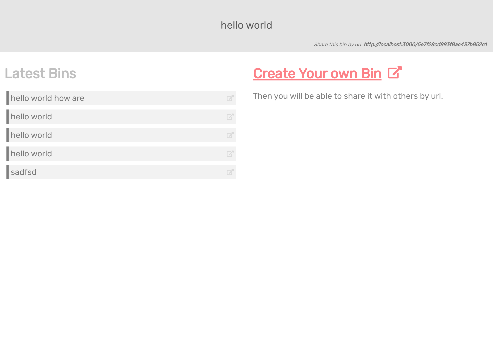
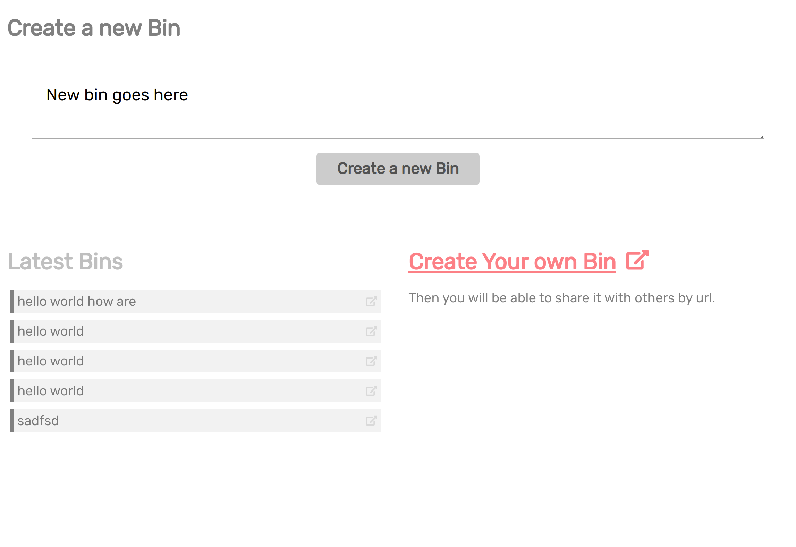

## A sample of JSDoc usage in express & react application

Available commands should be run from root folder of the repository

Server expects that mongodb runs on localhost which is specified by `MONGODB_CONN_STR` env variable in `server/.env`

### `yarn --cwd server start`
Starts server on port 8000 which is specified by `API_PORT` env variable in `server/.env`

Client code expects server to be up. Server url is configured by `REACT_APP_SERVER_URL` env variable in `.env`

Styles are a bit messy here

### `yarn start`
Starts client server on port 3000. Open this port in browser to visit client application.

## App is capable of showing bins by url

## App is capable of creating bin

